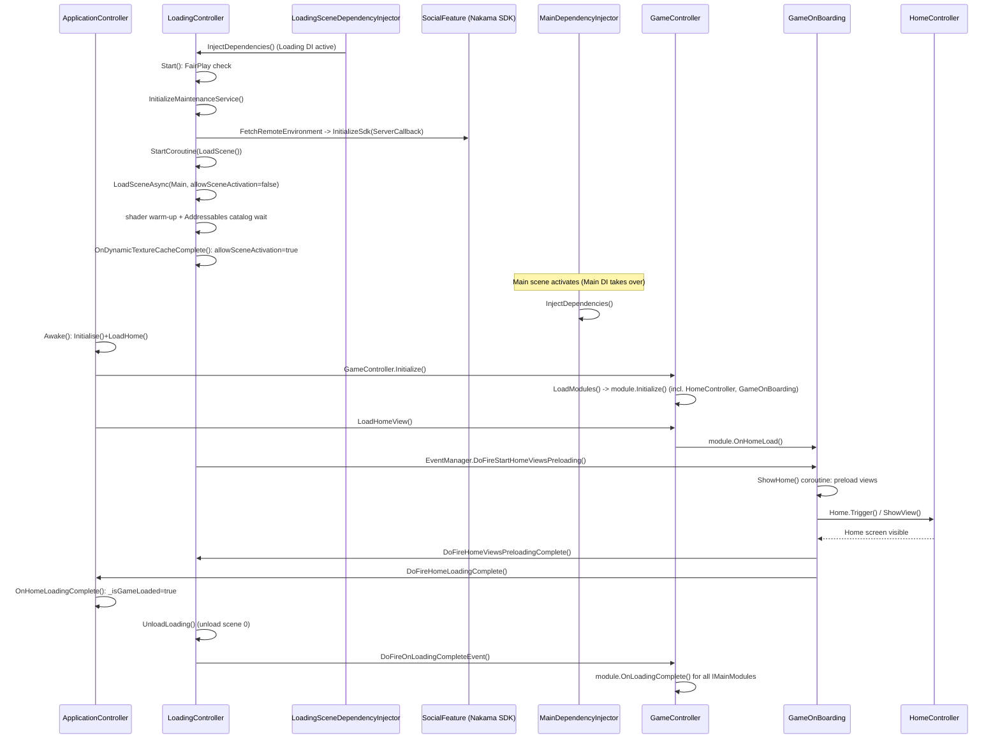
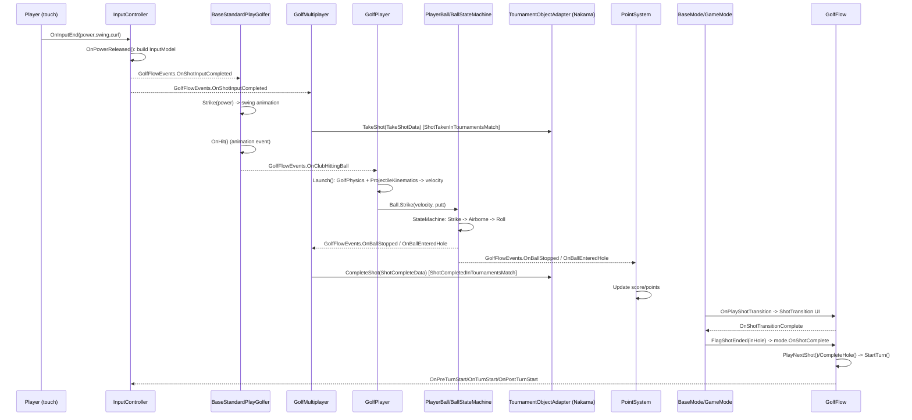
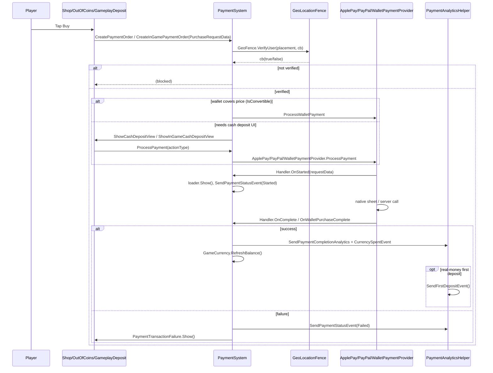
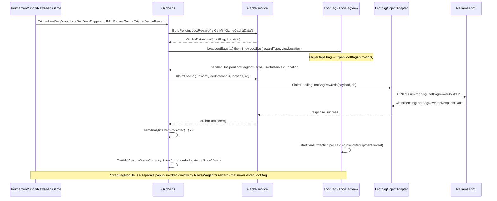
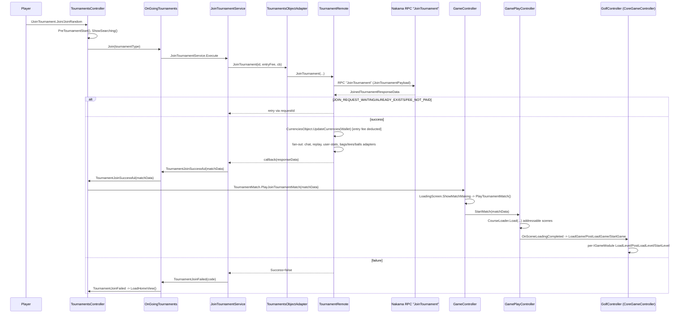
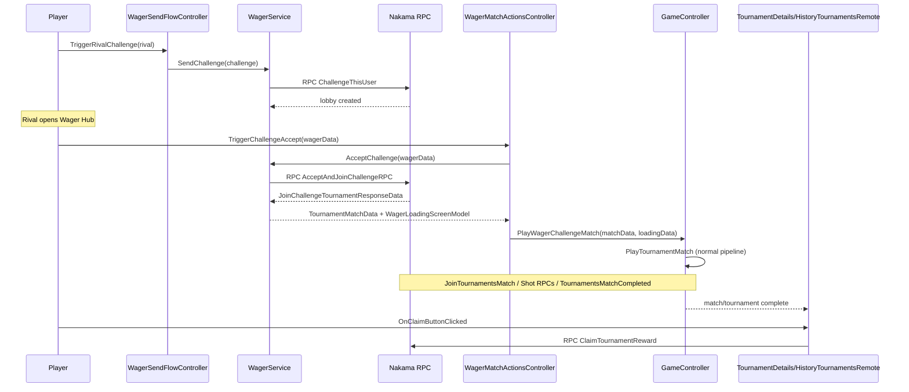
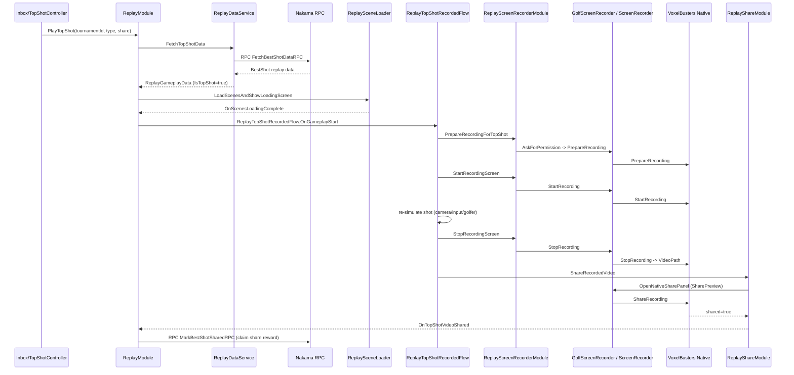

# Pro Golf — Engineering Onboarding Guide

This document is a from-scratch tour of the codebase for a new engineer: what the project is, how it's organized, the architectural patterns repeated everywhere, a module-by-module reference for every feature folder, and a glossary of project-specific jargon. It was generated by reading the actual source (not just folder names), so file/class names below are real and searchable.

---

## 1. What this project is

**Pro Golf** is a mobile (iOS-first) Unity golf game with live-ops events, tournaments, social features, mini-games, and monetization (payments, ads, gacha loot). A "round" is really a sequence of independent, asynchronously-played holes inside a **tournament** — players don't play head-to-head in real time; the server aggregates everyone's shots and ranks them.

**Tech stack**
- **Unity `6000.3.12f1`** (Unity 6.3), Universal Render Pipeline `17.3.0`.
- Addressables `2.9.1` (remote/streamed content), Cinemachine `2.10.7`, Timeline, Newtonsoft JSON.
- Firebase (analytics, auth, crashlytics, messaging), **Nakama** (social/tournament backend server), DOTween (tweening), **UniTask** (`Cysharp.Threading.Tasks` — use this for all async, not raw coroutines/`Task`), EnhancedScroller (list views).
- AppLovin **MAX** (ad mediation), Adjust (attribution analytics), VoxelBusters ScreenRecorderKit (native screen recording), Lofelt NiceVibrations (haptics), SRDebugger (in-game debug console).
- **No automated test suite.** Folders named `*Test*` under `Assets/_Golf/Features/Course` are art/level-editor tooling, not NUnit tests.
- All first-party code compiles into **one monolithic `Assembly-CSharp`** — there are no first-party `.asmdef` files, so any script can reference any other and there are no assembly boundaries to respect. `.asmdef`s and the many top-level `.csproj` files belong to third-party plugins only.

## 2. Repository layout

First-party code lives under `Assets/` in **six** roots (the sixth, `_Wager`, isn't yet documented in the original project README-style notes but is a real, fully-built feature):

| Root | Role |
|---|---|
| `Assets/_Golf` | Core golf game — courses, ball/shot physics, cameras, equipment, home/UI, live-ops. The largest area. |
| `Assets/_Casual` | Shared app framework — DI, UIView, Widgets, Build, Payments, Tournaments core, Offers, Configurations, and dozens of cross-cutting systems (audio, graphics settings, crash detection, etc). |
| `Assets/SocialFeature` | Nakama-backed social backend — chat, tournaments contracts, best-shot, daily reward, season pass, notifications. |
| `Assets/_Challenges` | Mini-games — ProShotChallenge, SpeedPuttingChallenge. |
| `Assets/_Replays` | Shot replay / screen recording. |
| `Assets/_Wager` | 1-vs-1 "rival" cash-wager challenge feature, built on top of the tournament-match pipeline. |

**Namespaces**: game code uses `MS.*` (e.g. `MS.Golf.UI`, `MS.Golf.Wallet`, `MS.Configurations`, `MS.DependencyInjection`, `MS.UIView`, `MS.Widgets`); the social backend uses `Mindstorm.SocialKit.*` (e.g. `Mindstorm.SocialKit.Tournaments`). Pure-gameplay tournament code that *consumes* the social contract lives in a separate `MS.Tournament.*` namespace — don't confuse the two.

**`Mindstorm.SocialKit.Tournaments` is the single highest blast-radius namespace in the codebase**: 392 files reference it repo-wide (191 outside `SocialFeature` entirely, spanning Payments, Chat, Gameplay, UI). Every hole of golf is played "inside" a tournament match, so this namespace's data models are the vocabulary every other system needs. Treat any change to its data models as high-risk.

## 3. Architecture patterns you'll see everywhere

### 3.1 Feature folder shape
A feature folder typically contains `Controller/`, `View/`, `Model/`, `Data/`, `Service/`, `Interface/`, `Analytics/`, and `ScriptableObjects/Resources/`. This repeats in `_Golf`, `_Casual`, `_Challenges`, `_Replays`, `_Wager`, and (with a slightly different naming convention) `SocialFeature`.

### 3.2 View ↔ Handler UI split (`MS.UIView`, `Assets/_Casual/Features/UIView/`)
- A `View` extends `BaseUIViewController<TRefs>` where `TRefs : BaseUIViewRefs` holds serialized scene references (buttons, texts). Views are presentation-only.
- Lifecycle: `Show(model)` → `RegisterEvents()` (once) → first-call-only `Initialize()` → `InitializeButtons()`/`InitializeTexts()` → `SetState(true)` (activates the GameObject). `Hide()` reverses this.
- The View receives dependencies as injected properties, conventionally `Handler` (an `IXxxViewHandler`), `UIEffects`, `Analytics`.
- The `Controller` implements `IXxxViewHandler` and owns feature logic; user actions flow View → Handler.
- **`Views` enum** (`Data/ViewEnums.cs`) has one entry per addressable view prefab — the addressable key is literally `viewId.ToString()`.
- **`UIViewController`** is the runtime engine: caches bound views in a dictionary with LRU eviction (`UIViewControllerConfig.MaxBindedViewsLimit`, with an `ExclusionList` of views that must never be evicted), loads prefabs via `Addressables.LoadAssetAsync<GameObject>(viewId.ToString())`, and is driven entirely through a **global static event bus** on `EventManager` — any code anywhere calls `EventManager.DoFireShowViewEventAsync(new UIViewDataModel(Views.LevelPause))` to open a view with no direct reference to the controller.
- Load views through **`ViewLoader`** (races the load against a delay threshold and only shows a loading widget if the load is slow) rather than instantiating directly.

### 3.3 Widgets (`MS.Widgets`, `Assets/_Casual/Features/Widgets/`)
"Widget" is a specific term here, distinct from generic UI or from a "View": a small, addressable-loaded, **not LRU-cached** (destroyed on hide, unlike Views) overlay popup or badge — tooltips, error banners, offer badges, FTUE popups. Enumerated by `WidgetType`. Managed by `WidgetsSystem : BaseMenuModule, IWidgetManager`, loaded from `Addressables` at path `Widgets/{WidgetType}`. `BaseWidget` exposes `[Inject] protected IWidgetManager Handler` so widgets can hide themselves or request other widgets.

### 3.4 Dependency injection (`MS.DependencyInjection`, `Assets/_Casual/Features/DependencyInjection/`)
Custom **reflection-based property injection** — not a container/IoC library, no registration, no lifetime scopes.
- Mark a property `[Inject]` and it gets populated by type-matching against a `BaseDependencyInjector` MonoBehaviour.
- `BaseDependencyInjector.InjectDependencies(object dependant)` walks the type hierarchy of `dependant` and, for every `[Inject]`-tagged property, calls `FindReferenceOfType(propertyType)`: if the injector itself matches, return itself; otherwise scan the injector's own private `[SerializeField]` fields for an assignable match. **Injection is scene-scoped** and **fails soft**: an unregistered type logs `Debug.LogError` and yields `null` — so a `null` injected dependency almost always means the scene's injector is missing a field for that type, not a bug in the consuming class.
- **`MainDependencyInjector`** is the main-scene god object: ~170 `[SerializeField]` references to nearly every feature controller in the game, with a ~500-line `InjectDependencies()` method that is, quite literally, the dependency graph of the entire app expressed as code. Reading this file is one of the fastest ways to understand what talks to what.
- `LoadingSceneDependencyInjector` (Loading scene) and `GameDependencyInjector`/`GolfDependencyInjector` (gameplay scene — the latter extends the former and wires ~40 gameplay module references together) are the other two scene-scoped injectors.

### 3.5 Configuration (`MS.Configurations`, `Assets/_Casual/Features/Configurations/`)
Gameplay is data-driven via `ScriptableObject` configs, referenced from **530 files** through one static access point: `Configs.AppConfigs`, `Configs.GameConfigs`, `Configs.GolfGameConfigs`, `Configs.GolfViewConfigs`, `Configs.ViewConfigs`.
- Each base type (`AppConfig`, `GameConfig`, `ViewConfig`, `GolfGameConfig`, `GolfViewConfig`) is declared as an almost-empty `partial class : ScriptableObject`. **~75 different feature folders each contribute their own fields** via their own `partial class GameConfig` file (e.g. `GameFlow/Configs/GameConfig.GameFlow.cs`), so config data stays physically co-located with the feature that owns it while remaining one runtime asset.
- `ConfigsInjector` loads each one via `Resources.Load<ScriptableObject>("Assets/" + fieldName)` — the Resources asset must be named exactly `AppConfigs`, `GameConfigs`, etc. Config assets live under each feature's `ScriptableObjects/Resources/`.

### 3.6 StateMachine (`MS`, `Assets/_Casual/Features/StateMachine/`)
A tiny generic FSM base (`IState { OnEnter, OnExit, Execute }`, `StateMachine<T> : IStateMachine<T>`) reused by ~9 independent systems: `CameraStateMachine`, `BallStateMachine`, `ClubStateMachine`, `GuideStateMachine`, `TutorialStateMachine`, `FtueStateMachine`, `BirdStateMachine`, `RewardStateMachine`, `ReplayGameplayStateMachine`. This is the standard pattern for any "mode/phase" logic in the game.

### 3.7 `IMainModule` / `BaseMenuModule` app lifecycle
Almost every top-level feature controller (`GameController`, `PaymentSystem`, `WidgetsSystem`, `GraphicsController`, `AudioController`, `GeoLocationFence`, `MiniGamesModule`, `ReplayModule`, `WagerModule`, etc.) implements `MS.IMainModule`, usually via `BaseMenuModule : MonoBehaviour, IMainModule`. This is a C# default-interface-method contract with empty-by-default lifecycle hooks — `Initialize()`, `OnPreGameStart()`, `OnGameStart()`, `OnHomeLoad()`, `OnLoadingComplete()`, `OnGameComplete()`, `OnGameUnload()`, `OnGameReload()`, `OnGameSceneLoadingComplete()`, `OnMiniGameStart/Exit()`, `OnReplayStart/Exit()`, `OnWagerGameStart()` — that the app-flow code calls into so it can broadcast lifecycle events without knowing every concrete system. **DI wires the references; `IMainModule` calls tell each wired system when to react.**

### 3.8 In-gameplay-scene conventions
- **`BaseGolfModuleController`** — the gameplay-scene specialization of `_Casual`'s `BaseModuleController<GolfMatchDataModel>`; nearly every in-match feature controller inherits it. Lifecycle called by `GolfController`: `Initialize()` → `LoadLevel(data)` → `PostLoadLevel()` → `StartLevel()`, bracketed by `RegisterEvents()`/`UnregisterEvents()`, ending in `UnloadLevel()`.
- **`GolfFlowEvents`** — a plain static set of `Action`/`Action<T>` delegates (`OnTurnStart`, `OnBallStopped`, `OnClubHittingBall`, `OnBallEnteredHole`, etc.) that most gameplay features use to talk to each other instead of direct references. This is the primary decoupling mechanism in the golf gameplay layer, the gameplay-scene equivalent of `_Casual`'s static `EventManager`.
- **Partial classes as the extension mechanism.** Central types like `GolfGameConfig`, `GameConstants`, `GolfEventManager`, `GolfFlowEvents` are empty `partial` shells in `Core`, and every feature contributes its own slice via `<TypeName>.<FeatureName>.cs` (e.g. `GolfGameConfig.BallSimulation.cs`). Expect fields for "your" feature to live in a small file of their own rather than one big config file.
- **"StandardPlay" prefix** — a `StandardPlay*` subclass (`StandardPlayPlayer`, `StandardPlayGolfCamera`, `StandardPlayEquipment`) is the normal on-course tournament implementation, as opposed to tutorial/mini-game variants.
- **Handler/interface injection** — tiny per-feature interfaces (`IPlayerBall`, `IGolferCamera`, `IGuideEquipment`, etc.) let features depend on narrow slices of each other, wired by the scene DI.

### 3.9 SocialFeature's own convention: Adapter → Server → Remote/Local
`SocialFeature` doesn't use `_Casual`'s attribute-based DI at all. Instead nearly every feature there follows: **`XObjectAdapter`** (public facade ScriptableObject, what other code calls) → **`XObjectServer`** (abstract contract, extends `BaseServer`) → **`XObjectRemote`** (real Nakama-backed implementation) → sometimes **`XObjectLocal`** (offline/stub implementation for editor testing without a live server). All wired together via serialized ScriptableObject references, auto-filled at author-time by editor tooling (`InjectionHelper`), and populated at runtime by a giant static locator class **`SocialConfigs`** via `Resources.Load` using field-name-as-asset-name convention (`SocialConfigsInjector`). This trades type-safety for near-zero per-feature boilerplate — which is exactly what the **`FeatureBaseGenerator`** editor tool (`Tools/SocialKit/Feature Base Generator`) exists to scaffold automatically for new features.

---

## 4. Module reference

### 4.1 `Assets/_Golf/Core/` — the composition root

Holds the shared, engine-level scaffolding every gameplay feature plugs into. Almost no gameplay logic itself.
- **`GolfController`** — `MonoBehaviour` root of a golf match, extends `_Casual`'s `CoreGameController<GolfMatchDataModel, GolfRefs>`. Discovers every `IGameModule<GolfMatchDataModel>` in the scene and drives them through Initialize → LoadLevel → PostLoadLevel → StartLevel → UnloadLevel.
- **`BaseGolfModuleController`** — thin `MS.Golf` specialization most feature controllers inherit.
- **`GolfMatchDataModel`** — the per-match data bag passed through the whole lifecycle: course reference, tournament meta, hole/wind/tee data, resume/continue state, random seed, rivals.
- **`GolfGameConfig` / `GameConstants` / `GolfEventManager`** — empty partial shells every feature extends. `GameConstants` at Core level only defines unit-conversion constants (m↔yd↔ft↔in, mph↔m/s).
- **`IGolfCourse` / `GolfRefs`** — course contract and scene reference bag.

### 4.2 Core golf gameplay (`Assets/_Golf/Features/`)

**Ball / BallSimulation / Physics** — the physical simulation stack.
- **Ball** owns the physical ball object: `GolfBall` (abstract) owns a `BallStateMachine` (`Idle → Airborne → Roll / PuttingStrike → PuttingRoll → Strike`), bounce/spin/aero effects, trail rendering, "close call" (near-miss) detection. `PlayerBall : GolfBall, IPlayerBall` is the concrete gameplay ball, firing `GolfFlowEvents.OnBallLaunched/OnBallBounce/OnBallStopped/OnBallEnteredHole/OnWaterHazard/OnBallOutOfBounds`.
- **BallSimulation** runs a *headless, invisible copy of the physics* in its own additive `PhysicsScene` to predict a putt roll or an aerial landing spot for the aim guide (`SimulateRoll()`), or a purely analytical bounce-by-bounce prediction for aerial shots (`SimulateAirborne()`, no physics scene — uses `GolfPhysics`/`ProjectileKinematics`/`Aerodynamics` directly).
- **Physics** is pure math, no MonoBehaviours: `GolfPhysics` (façade), `ProjectileKinematics` (parabolic trajectory math), `Aerodynamics` (curl/swing/wind deflection), `ClubPhysics` (per-club-type accuracy→deviation), `SpinPhysics`, `ApexPhysics`. This is where "how far/how curved" is actually computed.

**Player / Golfer** — the "who's taking this shot" split between physics and animation.
- **Player** (`GolfPlayer`, `StandardPlayPlayer`) owns Ball/Input/Equipment/Wind/Surface references and, on `GolfFlowEvents.OnClubHittingBall`, converts Input+Equipment+Wind into a launch velocity and calls `Ball.Strike()`.
- **Golfer** is the on-screen character/club-swing *animation* layer — separate concern from Player's physics role. Manages club selection/swap and swing tweens; `BaseClub.Swing()`/`In()`/`Out()` call back `OnHit`/`OnAboutToHit` at the moment the animated club crosses the ball. **Important**: the animation (Golfer) triggers the physics (Player) via `OnClubHittingBall`, not the other way around.

**Course / CourseInfo**
- **Course** — `GolfCourse : IGolfCourse` builds `CourseSceneData` (tee/bunker/green starting points, hole position, putting-roll config). Also contains environment art systems (grass, trees, props) and a large custom shader-driven Wind System for foliage/cloth sway — **not the same code** as gameplay `Wind` below, despite the shared name.
- **CourseInfo** — a separate metadata lookup service (`CourseInfoProvider` → `CourseInfoService`) returning course/hole *data* (par, yardage, names) for menus, distinct from the 3D scene.

**Camera** — `GolfCamera` (abstract state machine) with states `Aerial/PuttingAerial`, `Strike/PuttingStrike`, `FirstApex`, `ShotZoom`, `FlagShot`, `HoleZoom` (close-call zoom), `Tree`, `Celebration`, `Spectate`, `TopShot`. Implements a long list of small interfaces so nearly every other feature can query/change camera state.

**ClubInfo / ClubSwitcher / ControlSwitcher** — three small UI-control features that all listen to and re-fire the same `GolfFlowEvents` (aerial⇄shot control toggle, input started/completed/canceled) — a UI⇄state ping-pong pattern worth recognizing.

**Equipment stack** — four layered folders: **EquipmentInventory** (data layer: `Bag`/`Ball`/`Club`/`Tee` services, `ClubType` enum, `[Flags] ClubSurface` enum that must be **manually kept in sync** with the numeric values of `SurfaceType`), **Equipment** (math layer: computes derived `ClubAttributes`/`BallAttributes` from raw data + surface penalty), **EquipmentModels** (3D-model instantiation via Addressables), **EquipmentEffects** (cosmetic — `ClubAura` "legendary club" VFX).

**GameFlow / GameMode / GameplayConfigs**
- **GameFlow**: `GolfFlow : GameFlowController` drives `StartTurn()` and decides aerial-vs-shot control based on distance-to-hole. `GolfFlowEvents` (the central static event bus) lives here.
- **GameMode**: `GameModeBuilder.Build()` picks a concrete `IGameMode` from `TournamentMatchType` (`Tutorial`, `StandardStrokePlay`, `BunkerChallenge`, `Putting`, `NoGuides`, `StandardClubs`, `QuickDraw`) — this is the "what rules apply to this hole" switch. Also contains the Tutorial state-machine sub-tree.
- **GameplayConfigs**: bridges server-side live-ops-tunable numbers (wind factors, aero damp, launch angles) into `Configs.GolfGameConfigs` at match start.

**Input** — the entire touch shot-input pipeline: `InputController` orchestrates **Target** (aim placement, clamped by club range), **PullMechanism/Power** (drag gesture → Power/Overpower/Curl), **Swing** (classic swing-meter needle-timing minigame → accuracy/`SwingType`), **Spin** (optional forward/side spin panel). Bundles it all into an `InputModel` that `GolfPlayer` consumes.

**MatchComplete / MatchFailure / MatchHud / Score / ShotInfo / ShotTransition** — end-of-hole/HUD cluster. `Score` is raw stroke count (distinct from `PointSystem`'s bonus economy below); `MatchComplete` (`GolfMatchComplete`) is the heaviest screen controller in the codebase (13+ injected dependencies) — leaderboard, claim-reward, spectate entry, chat, next-hole flow.

**Surface group** (Surfaces / SurfaceEffects / SurfaceGrid / SurfacePenalty) — `SurfaceType` enum (`Tee, Fairway, Rough1-4, Sand, Fringe, Green, Water, Hole, Obstacle, OutOfBound, Road, Tree, FlagStick`); `SurfacePenalty` holds static power/accuracy penalty lookup tables per surface (e.g. Rough4 costs ~25% power, ~101% accuracy penalty); `SurfaceGrid` is the wireframe slope-overlay shown on the green while putting.

**Tee** — spawns the equipped tee-peg model and fires `GolfFlowEvents.OnTeeCreated` with the ball's resting position, which `GolfPlayer` listens for to place the ball.

**Wind** — generates the per-shot wind vector via a **seeded RNG** (`WindRandomizer`, reproducible per match via `RandomSeed`); `RestoreWind(shotsCount)` replays the RNG forward N times to reconstruct state on resume — a "deterministic seeded RNG for resumability" pattern reused elsewhere (bots, ghost replays).

**PointSystem** — a bonus-points economy layered on top of raw `Score`, used for tournament ranking/rewards: `TeePoints`, `ShotPoints`/`RecoveryPoints` (surface-transition lookup), `Gir`/GIR points (Green In Regulation, tiered Normal/Gold/Diamond/ParSetup), `PuttingPoints`, `ApproachPoints`, `SwingPoints`, plus a hole-completion bonus — all roll up into `TotalPoints`.

**PuttingPointer** — 3D putting aim indicator, distinct from the aerial Target ring used for full swings.

**Multiplayer / GhostPlayers / SpectateMode** — the bridge to the tournament/social backend. `GolfMultiplayer` builds `TakeShotData` on shot completion and routes it to an `IMatch` (`TournamentMatch`, `TutorialTournamentMatch`, `InGameTutorialMatch`). **GhostPlayers** replays other players'/bots' recorded shots as ghost balls (`Ticker` = the scrolling "so-and-so just holed out" notification feed). **SpectateMode** toggles watching other players post-timer-expiry.

### 4.3 Golf UI, live-ops, and session-flow features (`Assets/_Golf/Features/`)

**UI** — the biggest folder (~1770 files): the entire home-screen/menu presentation layer. `HomeController.cs` is the god-object wiring nearly every other feature into the home lifecycle. Sub-areas: Home (main menu, tab bar, trophy road, FTUE), TournamentDetail/TournamentSummary (pre/post-match screens), Leaderboard, TopShot/TopEarners, DailyRewards, CareerRewardsView/LevelProgressionRewards (XP/league progression), Personalisation (avatar/cosmetics), PhoneNumberFtue (in-menu OTP onboarding), Prize/PrizeFTUE, Maintenance (server-downtime screen), Tickers (scrolling banners).

**LiveOps** — drives the tournament/season event layer above core gameplay. `GolfLiveOps` aggregates `EventsPageController`, `QualifiersLeaderboardController`, `LiveOpsTourDetailController` ("Tour" = a themed multi-tournament season), `LiveOpsMatchController`, `TicketsCollection` (event entry tickets), `LiveOpsNews`, `EventRewardController`. `EventType` enum: `Championship`, `Finale`. Contains `LiveOps/GolfPass/` (a season/battle-pass system, tokens collected during gameplay via `TokenSystem`) and `LiveOps/LootBags/`.

**Chat** — three surfaces sharing a `_Core`: GlobalChat (server-wide public), TournamentChat (per-tournament, tied to leaderboard page), InGame (quick chat/emotes during a match). Backed by Nakama (see §4.4).

**Inbox** — `InboxModule` is the player's "News"/message center, unread badges, lazy remote-image loading, common reward-delivery surface (news items can carry SwagBag rewards).

**Shop** — `ShopController` aggregates daily rewards, gacha entry, payments, personalisation cosmetics, currency HUD, OTP-gated purchase. Product categories: DepositOffers, CoinOffers, LimitedTimeOffers, LootBagOffers, Themes (seasonal skins).

**Gacha** — `Gacha.cs` is the single "roll a reward" service invoked from Shop, News/Inbox, Home, Championship events. `Gacha/LootBag/` implements the specific reward type (cards, level bar, collection screen).

**SwagBag** — **not** a gacha roller; a reward-*presentation* popup revealing a bundle of already-granted rewards (equipment/currency/cosmetics). `SwagBagType`: `Personalisation`, `Equipment`, `PersonalisationAndEquipment`, `WagerChallenge`.

**BonusFeature** — `EquipmentBagBonus`, a passive cash/coin multiplier tied to the player's equipped bag.

**ClaimAllRewards** — "Claim All" button on the Tournament Results screen aggregating pending payouts into one action.

**TokenSystem** — collects Golf Pass tokens during gameplay (`OnShotInputCompleted`, `OnBallEnteredHole`), feeds `LiveOps/GolfPass`.

**GameplayDeposit / InGameDeposit / OutOfCash** — the "buy more cash mid-match" flow and its FTUE/fallback popups.

**TournamentLimitWarning** — server-configurable daily/per-category tournament play caps.

**TutorialTournament** — the scripted first tournament: bot opponents, its own FTUE state machine (`Idle → MoveToZone → InZone → InTrees → ReceiveBag`), grants the starter golf bag.

**PendingTournamentsRewards** — proactively checks for unclaimed rewards on Home load (distinct from ClaimAllRewards, which runs from the Results screen).

**Registration / OTPAuthentication / AccountLinking** — account creation form → phone verification (OTP = One-Time Password SMS, via Firebase) → cross-device account linking/restore.

**DeepLinking** — resolves incoming deep links (push notifications, marketing links), dispatched precisely on `EventManager.OnHomeViewsPreloadingComplete` to avoid a visible Home-screen flash.

**NotificationPermission** — requests/re-checks OS push permission.

**Guide** — the aim/trajectory-line system (not a tutorial): state machine between `NormalGuide` (full-swing line + bounce prediction) and `PuttingGuide` (putting line).

**LiveShotFeed** — shows opponents' shots live during a tournament (async multiplayer — simulates "someone just shot").

**Timer vs Time** — two distinct systems: **Timer** is the match/tournament countdown clock (HUD, force-end on expiry); **Time** controls simulation time-scale/pause during a shot (slow-motion/freeze-frame), unrelated to the clock.

**ResumeGame vs Resume** — also distinct: **ResumeGame** is app-level "returning from background" resync (Home, LiveOps, OnBoarding, MiniGames, Replays, Shop, Wager all notified); **Resume** is in-match "continue an interrupted shot/hole" (camera/guide/equipment/club-switcher restore, optional last-shot replay).

**ScreenRecorder / ScreenTransitions / Intro / CourseCutScene** — match-start visual flourish cluster: screen-capture wrapper (feeds `_Replays`), all loading-screen variants (initial/next-hole/tutorial/continue/matchmaking), the pre-hole cinematic intro, and the ambient course cutscene player (Timeline `PlayableDirector`).

**HUDIcons** — world-space Flag pin indicator and off-screen BallIndicator.

**Analytics** — `AnalyticsController` is the single façade fanning out to the in-house/Firebase backend and Adjust (third-party mobile attribution SDK).

**AppInfo / Database / AssetsManagement / DynamicTexturesLoading** — build/env info helper; local key-value persistence façade (`GolfDatabase` over `PlayerPrefsDatabase`); Addressables asset preloading + "download more content" UI; remote image pre-caching for frequently-changing art (tournament cards, hole thumbnails).

**UISound / Audio / EnvironmentAudio** — `UIEffects` (SFX+haptics façade for Views) / `GolfAudio` (core gameplay audio, extended per-feature via partials) / dynamic ambience layered on top (e.g. louder wind at higher camera altitude).

**InputBlocker** — blocks all taps while a modal reward flow animates, via a fan of small marker interfaces so each feature can request/release independently.

**DependencyInjection (golf-specific)** — `GolfDependencyInjector` extends the shared injector for the in-match scene; its `InjectDependencies()` wiring ~40 gameplay modules is the best single file for understanding gameplay module dependencies.

**_Debug** — QA/dev tooling: SRDebugger init, quick match-exit, admin-gated debug menu, forfeit-match service.

### 4.4 `Assets/SocialFeature/` — Nakama backend integration

**Nakama** is an open-source, self-hostable game server (auth, realtime sockets, storage, custom RPCs). This project uses it almost purely via **custom server-side RPCs** (`Client.RpcAsync(session, rpcName, jsonPayload)`) rather than Nakama's built-in match/leaderboard primitives.

- **`NakamaServer`** (`Sdk/Scripts/Core/Scripts/`) — owns Nakama's `IClient`/`ISocket`/`ISession`. Auth is **device-ID based** (`AuthenticateDeviceAsync`, anonymous/device-bound accounts, no username/password). `Environment` enum (`LiveHeroic`=prod, `Staging`, `Dev`, `Custom`) selects which server cluster to hit.
- **`ServerController`** — boot singleton (`[RuntimeInitializeOnLoadMethod]`, `DontDestroyOnLoad`) wiring socket callbacks (`ReceivedChannelMessage` → chat, `ReceivedNotification` → notifications) into an internal `EventManager` pub/sub hub.
- **Request pipeline**: a feature's `...ObjectRemote` builds a `ClientRequest` (RPC name + JSON payload) → `RequestHandler` (polling queue, session/socket validation, retry up to 2x, escalates to a failure popup, forces logout on HTTP 401/invalid-session) → response deserializes into a `SocialBaseResponse` envelope carrying piggybacked global fields (server clock, force-update flag, maintenance config, account-suspension flag) applied regardless of the calling feature.

**Tournaments contract** — `TournamentServer` (abstract) → `TournamentRemote` (real network impl, fans results out to ~10 other feature adapters via `SocialConfigs`) / `TournamentLocal` (offline stub for demo scenes) → `TournamentsObjectAdapter` (public facade, split via partials: `.Match`, `.Current`, `.Detail`, `.Update`, `.Configs`, `.Leaderboard`, `.Completed`). Data models: `TournamentInstanceData`, `JoinedTournamentData`, `TournamentProgress`, `TournamentMatchData`/`TournamentShotData` (per-hole state machine), `TournamentConfigsData` (server-defined templates), `LiveShotsFeed`, tutorial-tournament tree.

**Chat** — `ChatRemote` is the single subscriber to socket messages, deserializes into `BaseMessageContent`, routes by a `ChatType` int index into a serialized list of module chat servers (Global vs Tournament) — a fragile-by-design index-based dispatch. GlobalChat = world/lobby chat + pinned messages; TournamentsChat = per-match channel, auto-joined when a tournament is joined.

**BestShot / DailyReward / SeasonPass** — all follow the Adapter→Server→Remote pattern.
- BestShot: capture/share your best tournament shot, rewards on share.
- DailyReward: classic login-streak claim, whose claim response fans out to Currencies/Clubs/UserProgress/Balls/Tees/Lootbag in one round trip.
- SeasonPass ("Pro Pass"): free vs paid track, tokens/XP economy, season-exclusive store offers, tightly coupled to Tournaments and Offers.

**Notifications** — Nakama's in-app async push (distinct from chat *and* from OS push): socket event → `NotificationsRemote` maps `notification.Code` to a `NotificationCodes` enum (`TournamentConclusion`, `PendingRewardUpdate`, `Challenge*` variants, `AccountLinkingStatusUpdate`, etc.) → deserializes into a typed `BaseNotification` → side-effects the relevant adapter → re-broadcasts a game-facing event for toasts/badges.

**FeatureBaseGenerator** — editor scaffolding tool (`Tools/SocialKit/Feature Base Generator`): generates the Adapter/Server/Remote boilerplate for a new feature, then a `[DidReloadScripts]` hook materializes the actual `.asset` ScriptableObject instances after Unity recompiles (two-phase because you can't instantiate a ScriptableObject of a type in the same tick you wrote its script).

**InjectionHelper** — editor-only auto-wiring: reflection-based `ScriptableObjectAutoInjector` fills null serialized-reference fields on assets by type match; `SocialConfigsInjector` (runtime) reflects over every static field on `SocialConfigs` and `Resources.Load`s the matching asset by field-name convention.

### 4.5 Mini-games, replays, wager (`Assets/_Challenges`, `Assets/_Replays`, `Assets/_Wager`)

**`_Challenges`** — two active arcade mini-games, entered from the Home news feed via `MiniGamesModule` (a `_Casual`-owned `BaseMenuModule` extended per-challenge via `partial class`).
- **ProShotChallenge** — aerial ring/hoop precision-shot mode: one timed shot, reward tier by which ring the ball lands in.
- **SpeedPuttingChallenge** — timed putting-only mode: sink as many balls as possible before time runs out.
- Both mirror the same shape: `<Challenge>.cs` orchestrator → `<Challenge>Gameplay.cs` scene controller (composed of per-concern partials: Camera/Wind/Tee/Timer/Ui/Equipment) → `<Challenge>Services.cs` network gateway.
- `_Challenges/Gacha` is a two-file **bridge**, not a separate implementation — `IMiniGamesGacha` forwards straight into the real Gacha/LootBag system in `_Golf/Features/Gacha`.

**`_Replays`** — shot replay (deterministic **re-simulation** from stored shot data, not literal video playback by default) plus opt-in **native OS screen recording** (VoxelBusters ScreenRecorderKit, wrapped by `_Golf`'s `GolfScreenRecorder` → `_Casual`'s `ScreenRecorder`) for saving/sharing a "Top Shot". `ReplayModule` exposes `PlayReplay(...)` (watch a specific hole) and `PlayTopShot(...)` (watch/share your own best shot, reachable from Inbox). `ReplayGameplay` has two camera/gameplay states: **SimpleMode** (free camera, all players) and **DetailedMode** (per-player follow/ball/player camera, default).

**`_Wager`** — a **1-vs-1 real-money/soft-currency "rival" challenge**: entry fee + defined reward, played as a real scored round through the shared tournament-match pipeline (`IWagerGameController.PlayWagerChallengeMatch`, implemented by the same shared `GameController` used for normal tournaments — `_Wager` contains no golf-gameplay scene code of its own). `WagerModule` composes `WagerService`, `WagerHubController`, `WagerLeaderboardController`, `WagerSendFlowController` (send/accept challenge), `WagerMatchActionsController`, `WagerRewardClaimController`, `WagerFundsRecovery`.

### 4.6 `Assets/_Casual/Features/` — shared framework, selected highlights

(Most already covered in §3; below are the remaining notable systems, grouped by concern.)

- **Build** — Editor-only CI tooling (`Builder.BuildiOS/BuildAndroid/BuildAndroidAAB`, invoked via `-executeMethod` from CI), parses custom CLI args, drives Addressables build + `BuildPipeline.BuildPlayer`. Distinct at runtime from **RemoteBuildConfigs** (`MS.Build` namespace, confusingly shared) — a runtime `MonoBehaviour` that asks a server which backend `Environment` a given build+version should point at, so the same binary can be silently redirected to staging/prod/hotfix without a new App Store submission.
- **PaymentSystem** (`MS.Casual.Payments`) — real-money purchases. `PaymentSystem` constructs `ApplePayPaymentProvider`/`PayPalPaymentProvider`/`WalletPaymentProvider`; every purchase gates through `GeoFence.VerifyUser(placement, ...)` first (see GeoFencing) before routing to wallet balance, PayPal, or Apple Pay.
- **GeoFencing** — location-based eligibility gate (jurisdiction restrictions on real-money features); every payment flow depends on it.
- **Offers** — starter packs, deposit offers; builders (`DepositOfferDataBuilder`) turn server offer config into purchasable data consumed directly by `PaymentSystem.CreatePaymentOrder`.
- **GameOnBoarding** (`MS.OnBoarding`) — the central FTUE orchestrator, wired bidirectionally into nearly every other system (`ITutorialMatch`, `IOnBoardingGacha`, `ISeasonOnBoarding`, etc.) — the single largest hub of dependency wiring besides Home itself.
- **Audio** (`MS.Audio`) — `AudioController` dispatches all playback through a small job system (`Play`/`PlayDynamic`/`PlayOneShot`/`Stop`) rather than calling `AudioSource` directly, to decouple fade timing from call sites. Notable gotcha documented in-code: the shared mixer asset loads as **two separate runtime instances** (one from Resources refs, one from the Addressables bundle) — every volume change must be applied to both or sounds routed through the un-muted instance leak volume.
- **Sdks** — wraps third-party integrations: AppLovin **MAX** ad mediation (`Monetization`/`MaxAds`/`Interstitial`/`RewardedVideo`), Adjust attribution, Firebase Analytics.
- **GraphicsSelecion** *(sic — misspelled in the actual repo path, keep the misspelling when referencing it)* — device-tiered URP graphics quality settings (Low/Medium/High), auto-detected and manually overridable in Settings.
- **CrashDetector** — lightweight in-app exception/low-memory overlay for QA builds (`Application.logMessageReceived`/`Application.lowMemory`), separate from Firebase Crashlytics which handles production crash reporting.
- **FairPlay** — anti-tamper/device-integrity check (`FairPlayInspector.Run()`), run synchronously at the very start of `LoadingController.Start()` before anything else.
- **Database** (`MS`/`MS.Database`) — `Database<T>` generic persisted-value wrapper (`DatabaseBool`, `DatabaseInt`, etc.) over `DatabaseManager`, which wraps `PlayerPrefs` but **encrypts every key and value** before storage so raw PlayerPrefs inspection doesn't reveal player data.
- **Loading** — the one-time splash/loading **scene** shown at cold app start (`LoadingController`: FairPlay check → maintenance-mode check → Nakama SDK init → additive load of Main scene with `allowSceneActivation=false` → shader warm-up + Addressables catalog download → flip scene active) — distinct from **MainTransitionScreen**, which is the lighter transition shown between Home and a match *after* the app is already running.
- **ShaderPrewarmer** — pre-warms shader variants (course/grass/gameplay materials) to avoid first-use stutter; gates the Loading-scene flow on first run only.

## 5. Key end-to-end flows

The module reference above tells you what each piece does; this section traces real, file:line-referenced paths through the code so you can see how the pieces actually fire in sequence. Line numbers are approximate (source shifts over time) but the file paths, method names, and call order are accurate as of this writing — use them as a starting trail, not gospel.

### 5.1 App boot sequence (cold start → Home visible)

Two scenes exist: **Loading** (scene 0, active first) and **Main** (scene 1, additively loaded). Two `DependencyInjector`s exist per scene: `LoadingSceneDependencyInjector` wires Loading-scene-only services (maintenance, remote config, game assets, account suspension) into `LoadingController`; `MainDependencyInjector` wires the ~170 modules under `Main` (`GameController`, `HomeController`, etc.) and only runs once `Main` is loaded/activated.

1. `Assets/_Casual/Features/DependencyInjection/Controller/LoadingSceneDependencyInjector.cs:17` — `Awake()` calls `InjectDependencies()` (line 22), wiring `_loadingController.MaintenanceModeHandler/ServerConfigs/GameAssets/AccountSuspension`. **(Loading injector active)**
2. `Assets/_Casual/Features/Loading/Core/Controller/LoadingController.cs:52` — `Start()` coroutine: waits 2 frames, builds `LoadingBackground` (lines 57-59), runs `FairPlayInspector` (lines 61-67) — bails out on failure.
3. `LoadingController.cs:69-70` — `InitializeMaintenanceService()` / `RegisterMaintenanceEvents()` set up `LoadingMaintenanceModeService`.
4. `LoadingController.cs:72-75` — `ServerConfigs.FetchRemoteEnvironment(...)` then, on completion, calls `Mindstorm.SocialKit.SocialFeature.InitializeSdk(ServerCallback)` — this is the Nakama SDK bootstrap.
5. `LoadingController.cs:77` — kicks off `_loadingCoroutine = StartCoroutine(LoadScene())` in parallel with step 4.
6. `LoadingController.cs:109 LoadScene()`:
   - `:122-123` `SceneManager.LoadSceneAsync(1, LoadSceneMode.Additive)` with `allowSceneActivation = false` — Main scene begins loading additively but stays inactive.
   - `:126` `_loadingProduction.StartLoading()` drives the visible progress bar.
   - `:129-146` If the in-game tutorial isn't complete, short-circuits: waits for `GameAssets.IsComplete`, fires `LoadingEvents.DoFireLoadingScreenStartToDisappearEvent()`, unloads the Loading scene, fires `EventManager.DoFireOnLoadingCompleteEvent()`, and returns early (first-run path, skips the shader-warmup gate below).
   - `:149-151` (normal/returning-user path) `_shadersWarmUp.WarmUp()` (`Assets/_Casual/Features/Loading/Shaders Warm-up/Controller/LoadingShadersWarmUp.cs`) — waits until `IsComplete`.
   - `:154-158` waits for Addressables `GameAssets.IsComplete` (catalog download), updating `_loadingProduction.SetAssetCatalogProgress`.
   - `:160-161` waits for `_mainSceneLoadingHandle.allowSceneActivation` to flip true.
7. `LoadingController.cs:326-331 ILoadingCacheHandler.OnDynamicTextureCacheComplete()` — called once dynamic-texture caching finishes; creates a `FirebaseController` instance, calls `InitializeMax()` (AppLovin MAX), and **sets `_mainSceneLoadingHandle.allowSceneActivation = true`** — this is what actually lets the Main scene activate.
8. Main scene activates → its root `MainDependencyInjector.InjectDependencies()` runs, wiring `ApplicationController.GameController`, `GameController.*`, `HomeController.*`, etc. **(Main injector becomes active from here on)**
9. `Assets/_Casual/Features/Application/Controller/ApplicationController.cs:28 Awake()` — sets frame rate/orientation, then `:40 Initialise()` → `DependencyInjector.InjectDependencies()` (idempotent second pass) + `GameController.Initialize()`, then `:41 LoadHome()` → `GameController.LoadHomeView()`.
10. `Assets/_Casual/Features/Game/Controller/GameController.cs:52 Initialize()` → `InitializeService()`, `InitializeEvents()` (subscribes `OnLoadHomeView`, `OnLoadingComplete`, etc. at lines 61-65), `LoadModules()` (line 87: `GetComponentsInChildren<IMainModule>()`, then `module.Initialize()` on each — this is where `HomeController`, `GameOnBoarding`, etc. initialize).
11. Back in `LoadingController.LoadScene()`: `:163-167` a few frame yields, then `EventManager.DoFireStartHomeViewsPreloading()`.
12. `Assets/_Casual/Features/GameOnBoarding/Core/Controller/GameOnBoarding.cs:99 OnHomeLoad()` (invoked from `GameController.LoadHomeView` line 99-105) — if `IsInGameTutorialComplete`, sets up `waitForPreloading`/`waitForLoadingComplete` flags tied to `EventManager.OnStartHomeViewsPreloading`/`OnLoadingComplete`, then starts a local `ShowHome()` coroutine.
13. `GameOnBoarding.cs:135 ShowHome()`:
    - `:144-150` preloads `HomeConstants.HomePreloadViews`, `DataSyncLoaderView`, `RandomHoleSelectionView` via `EventManager.DoFirePreloadViewsEventAsync`.
    - `:153` `Home.Trigger()` — `HomeController.cs:230 ShowView()` actually shows the Home UI canvas here — **Home screen becomes visible at this point**.
    - `:155` fires `EventManager.DoFireHomeViewsPreloadingComplete()` — this is what `LoadingController` (lines 98/333) is waiting on.
    - `:159-163` `Home.SetTouchBlockerState(true)`, `TriggerNormalFlow()`, then fires `EventManager.DoFireHomeLoadingComplete()`, consumed by `ApplicationController.cs:113 OnHomeLoadingComplete()` which sets `_isGameLoaded = true` (enables pause/resume event firing from here on).
14. Back in `LoadingController.LoadScene()`: `:169-184` waits for the home-preloading-complete flag, finishes the progress bar to 100%, plays the Out animation, `UnloadLoading()` (unloads scene 0), then fires `EventManager.DoFireOnLoadingCompleteEvent()`, consumed by `GameController.cs:151 OnLoadingComplete()` (calls `OnLoadingComplete()` on every `IMainModule`) and by `GameOnBoarding`'s local completion handler.

### 5.2 One full golf shot, end to end

1. `Assets/_Golf/Features/Input/_Core/Controller/InputController.cs:441 IPowerHandler.OnInputEnd(power, swing, curl)` — called by the power/swing UI on finger release; calls `OnPowerReleased(...)` (line 469) which builds the `InputModel` struct (`Assets/_Golf/Features/Input/_Core/Model/InputModel.cs:19`) at `InputController.cs:486` and sets `_completed = true`.
2. `InputController.cs:448/463` — fires `GolfFlowEvents.OnShotInputCompleted?.Invoke()` (declared `Assets/_Golf/Features/Input/_Core/Events/GolfFlowEvents.Input.cs:12`); also invokes the ScriptableObject `_inputEndEvent` with `_inputData`.
3. `Assets/_Golf/Features/Golfer/_Core/Controller/BaseStandardPlayGolfer.cs:94 OnShotInputCompleted()` reads `Input.Power`/`Input.Swing`, then calls `Strike(power, isPerfectSwing)` (line 99) → base `Golfer.cs:131 Strike()` triggers the swing animation via `_clubs.Swing(swingType, power, true)`.
4. `Assets/_Golf/Features/Multiplayer/Core/Controller/GolfMultiplayer.cs:47 OnShotInputCompleted()` (fires in parallel with step 3) builds a `TakeShotData` (lines 52-75) from `Player.GetLaunchVelocity`, `Wind`, `ShotInput`, `Equipment`, then calls `_match.TakeShot(data)` (line 77) — the **first** network round-trip, sent before the ball is even struck locally (server records the intended shot).
5. `Assets/_Golf/Features/Golfer/_Core/Controller/Golfer.cs:150 OnHit()` — invoked by an **animation event** on the swing clip when the club model reaches the ball; calls `_shotEffects.OnHit(...)` then fires `GolfFlowEvents.OnClubHittingBall?.Invoke()` (line 152).
6. `Assets/_Golf/Features/Player/Controller/GolfPlayer.cs:91 OnClubHittingBall()` calls `Launch(Equipment.IsPutting)` (line 93).
7. `GolfPlayer.cs:135 Launch(putt)` → `GetLaunchVelocity(putt)`:
   - Normal shot: `GolfPlayer.cs:161 SetupNormalStrike()` → `GolfPhysics.CalculateShotApex(...)` (`Assets/_Golf/Features/Physics/Controller/GolfPhysics.cs:19`) computes apex height, then `ProjectileKinematics.CalculateVelocity(launchPosition, targetPosition, apex)` (`Assets/_Golf/Features/Physics/Controller/ProjectileKinematics.cs:27`) plus `BallVelocityDataBuilder.Build(...)` (`Assets/_Golf/Features/Player/Controller/BallVelocityDataBuilder.cs:6`) folds in swing/curl/spin/wind to produce the final `LaunchVelocity`.
   - Putt: `GolfPlayer.cs:150 SetupPuttStrike()` → `GolfPhysics.GetPuttShotVelocity(...)`.
   - `GolfPlayer.cs:147 Ball.Strike(_launchVelocity, putt)`.
8. `Assets/_Golf/Features/Ball/_Core/Controller/PlayerBall.cs:67 Strike(velocity, roll)` → base `GolfBall.cs:103 Strike()` sets `IsStruck=true`, `LaunchVelocity`, and `ChangeState(roll ? StateType.PuttingStrike : StateType.Strike)` via `BallStateMachine`; `PlayerBall.cs:74` fires `GolfFlowEvents.OnBallLaunched?.Invoke(...)`.
9. Strike state exits almost immediately → `ChangeState(StateType.Airborne)`. `Assets/_Golf/Features/Ball/StateMachine/States/Airborne/Airborne.cs:51 Execute()` runs projectile physics each `FixedUpdate` (aerodynamics/wind applied to velocity), and `:71 OnCollisionEnter` bounces the ball (`PlayerBall.cs:117 OnBounce` fires `GolfFlowEvents.OnBallBounce`).
10. `Airborne.cs:130 CheckForExit()` → `ChangeState(StateType.Roll or PuttingRoll)`. `Assets/_Golf/Features/Ball/StateMachine/States/Roll/Roll.cs:128 CheckForExit()` watches speed; once below `StopSpeed` calls `Stopped()`.
11. `PlayerBall.cs:127 BallStopped()` fires `GolfFlowEvents.OnBallStopped?.Invoke()` (line 131) — **or**, if the ball fell in the cup instead, `PlayerBall.cs:135 Holed()` fires `GolfFlowEvents.OnBallEnteredHole?.Invoke()` (line 140).
12. Multiple listeners react to `OnBallStopped`/`OnBallEnteredHole` in parallel:
    - `Assets/_Golf/Features/Multiplayer/Core/Controller/GolfMultiplayer.cs:148 OnBallStopped()` builds `ShotCompleteData` and calls `_match.CompleteShot(data)` (line 156) — **second** network round-trip.
    - `Assets/_Golf/Features/PointSystem/Core/Controller/PointSystem.cs:309 OnBallStopped()` / `:321 OnBallEnteredHole()` update shot/green/hole points and score.
13. `TournamentMatch.CompleteShot` (`Assets/_Golf/Features/Multiplayer/Tournament/Core/Controller/TournamentMatch.cs:46`) → `TournamentMatchShots.CompleteShot` (`.../TournamentMatchShots.cs:75`) enqueues a `ShotCompleteService`, which calls `SocialConfigs.TournamentObjectAdapter.ShotCompletedInTournamentsMatch(...)` (RPC `ShotCompletedInTournamentsMatch`) — the earlier `TakeShotService.Execute()` (step 4) called `ShotTakenInTournamentsMatch(...)` for the initial request. Both go through the Adapter → Server → Remote/Local pattern (§3.9).
14. If holed: `GolfMultiplayer` also listens for `GolfFlowEvents.OnHoleComplete` (fired from `GolfFlow.GameMode.cs:57 IGameModeFlow.CompleteHole()`) → builds a final `ShotCompleteData` and calls `_match.CompleteMatch(shotData, Points.TotalPoints)` → `TournamentMatch.CompleteMatch` → `TournamentMatchShots.CompleteMatch` enqueues `MatchCompleteService`.
15. UI reactions: `Assets/_Golf/Features/MatchHud/_Core/Controller/MatchInfoHud.cs:72 OnClubHittingBall()` hides the match HUD as soon as the club strikes; the camera blends to the flight-follow cam, then on landing fires `GolfCamera.OnCameraFlagShotCompleted`, consumed by `Assets/_Golf/Features/GameMode/Core/Controller/BaseMode.cs:52 OnCameraFlagShotEnded()` — if the ball is in the hole, calls `GameModeFlow.FlagShotEnded(true)`; otherwise `GameModeFlow.OnPlayShotTransition()` fires `GolfFlowEvents.OnPlayTransition`, picked up by `Assets/_Golf/Features/ShotTransition/Core/Controller/ShotTransition.cs:62 OnShowTransition()`.
16. `ShotTransition.cs:72 OnShotTransitionComplete()` → `Flow.OnShotTransitionComplete()` fires `GolfFlowEvents.OnShotTransitionComplete` → `BaseMode.cs:58` → `GameModeFlow.FlagShotEnded(false)`.
17. `GolfFlow.GameMode.cs:9 IGameModeFlow.FlagShotEnded(inHole)` fires `GolfFlowEvents.OnFlagShotEnded(inHole)` → `Assets/_Golf/Features/GameMode/Core/Controller/GameMode.cs:46` → `_mode.OnShotComplete(inHole)` (e.g. `StrokePlayMode.OnShotComplete`) → not-holed: `GameModeFlow.PlayNextShot()` → `StartTurn()`; holed: `GameModeFlow.CompleteHole()`.
18. `Assets/_Golf/Features/GameFlow/Controller/GolfFlow.cs:20 StartTurn()` fires `OnPreTurnStart` → `OnTurnStart` → `OnPostTurnStart` and calls `SelectControl()` (line 28) — this re-arms `InputController` and `GolfPlayer` for the next shot, closing the loop back to step 1.

### 5.3 Real-money purchase flow

1. `Assets/_Golf/Features/UI/OutOfCoins/_Core/Controller/OutOfCoinsModule.cs:45-48` — `IOutOfCoinsViewHandler.OnBuyButtonClicked` builds `PurchaseRequestData` and calls `Payments.CreatePaymentOrder(requestData)` (also reachable from `Assets/_Golf/Features/Shop/Core/Controller/ShopController.cs:107-125`, `Assets/_Casual/Features/Offers/Packs/Core/Controller/OfferPackSystem.cs:109`, `Assets/_Casual/Features/Offers/Generic/Core/Controller/GenericOfferSystem.cs:106`, and `Assets/_Wager/_Core/Integration/PaymentSystem.Wager.cs:27`).
2. `Assets/_Golf/Features/GameplayDeposit/Controller/GameplayDepositController.cs:19` → `Assets/_Golf/Features/InGameDeposit/Controller/InGameDeposit.cs:95` — the in-round "not enough cash" path calls `_payments.CreateInGamePaymentOrder(purchaseRequestData)` instead.
3. `Assets/_Casual/Features/PaymentSystem/_Core/Controller/PaymentSystem.cs:71` (`CreatePaymentOrder`) / `:93` (`CreateInGamePaymentOrder`) — entry points implementing `IOffersPayment`/`IPaymentsInGame`.
4. `PaymentSystem.cs:73`/`:95` — `GeoFence.VerifyUser(purchaseRequestData.Placement, result => ...)` gate (`Assets/_Casual/Features/GeoFencing/Core/Controller/GeoLocationFence.cs:24-42`): short-circuits `true` if already verified (lines 26-30), otherwise starts geolocation and resolves later via `UserVerificationComplete`/`UserVerificationFailed` (lines 61-71).
5. On gate pass, `PaymentSystem.cs:77-82` branches: if `Config.IsConvertible && WalletBalance >= Config.Price` → `ProcessWalletPayment` directly, **skipping the deposit UI**.
6. Otherwise `PaymentSystem.cs:84-88`/`:106-111` opens the Cash Deposit Info view, whose button callback is `ProcessPayment(purchaseRequestData, buttonAction)` (lines 116-133), switching on `PurchaseActionType`: `Wallet` → `WalletPaymentProvider` (`Providers/Wallet/Controller/WalletPaymentProvider.cs:11-24`); `Paypal`/`VisaCard` → PayPal provider; `ApplePay` → `ApplePayPaymentProvider` (`Providers/ApplePay/Controller/ApplePayPaymentProvider.cs:21-48`); `Cancel` → `OnTransactionFlowComplete?.Invoke(false)`.
7. `ApplePayPaymentProvider.cs:25` — `Handler.OnStarted(purchaseRequestData)` fires first (`PaymentSystem.cs:145-150`: hides resume flow, shows loader, sends `IAPStatus.Started` via `PaymentAnalyticsHelper.SendPaymentStatusEvent`). Same call happens in `WalletPaymentProvider.cs:13`.
8. `ApplePayPaymentProvider.cs:26-47` — native sheet callback; success calls `ProcessApplePayTransaction` → `ApplePayService.PurchaseCashWithApplePay` (server receipt validation) → `Handler.OnComplete(...)`.
9. `WalletPaymentProvider.cs:15-23` — `WalletPaymentService.ProcessConvertibleOffer(...)` deducts wallet balance server-side, then calls `Handler.OnWalletPurchaseComplete(...)`.
10. `PaymentSystem.cs:152-188` — `OnWalletPurchaseComplete`: restores resume flow/hides loader, `GameCurrency.RefreshBalance()`; on failure sends `IAPStatus.Failed` + shows `PaymentTransactionFailure`; on success calls `SendPaymentCompletionAnalytics` then `EconomyAnalytics.CurrencySpentEvent(...)` tagged `GameConstants.WalletPurchase`.
11. `PaymentSystem.cs:190-210` — `OnComplete` (real-money paths): same split; on success also calls `_paymentAnalyticsHelper.SendFirstDepositEvent()` (gated on `PlayerInfoService.MetaData?.UserPaymentInfo?.IsPaying`).
12. `PaymentAnalyticsHelper.cs:139-143` (`SendPaymentCompletionAnalytics`) → `SendPaymentStatusEvent(IAPStatus.Completed,...)` and `SendPaymentDepositEvent` (Adjust-tagged deposit event in production) plus `SendCurrencySourceEvent` → `EconomyAnalytics.CurrencySpentEvent(GameConstants.PaymentPurchase, ...)`.

### 5.4 Gacha / loot-bag reward roll flow

1. Trigger call sites all funnel into `Assets/_Golf/Features/Gacha/_Core/Controller/Gacha.cs`: tournament reward (`Gacha.cs:170-178`/`76-88`, sourced from `GachaService.BuildPendingLootReward()`), shop purchase (`Gacha.cs:185-193`), news item (`Gacha.cs:200-212`/`219-231`), or the mini-game bridge `Assets/_Challenges/Gacha/Controller/Gacha.MiniGames.cs:9-19` (`IMiniGamesGacha.TriggerGachaReward`, interface `Assets/_Challenges/Gacha/Interface/IMiniGamesGacha.cs:8-12`), which pulls `GachaService.GetMiniGameGachaData()` instead.
2. All paths resolve a `GachaDataModel { LootBag, Location }` (`Assets/_Golf/Features/Gacha/_Core/DataModel/GachaDataModel.cs:4-8`) tagged with `GachaRewardType`/`GachaRewardLocation` via `LootBagDataBuilder.Build(...)` inside `GachaService`.
3. `Gacha.cs:57-71 ShowLootReward` — sets `InputBlocker.SetInputBlocker(true)`, starts `_lootBag.LoadLootBags(...)` (`Assets/_Golf/Features/Gacha/LootBag/_Core/Controller/LootBag.cs:68`, preloads via `LootBagCaching.PreloadLootBagAsync`), then calls `_lootBag.ShowLootBag(...)` which fires `Views.LootBagView`.
4. `Assets/_Golf/Features/Gacha/LootBag/_Core/View/Controller/LootBagView.cs:275-284 OpenLootBagAnimation` — player taps to open; calls `_handler.OnOpenLootBag(id, userInstanceId, location)`.
5. `Gacha.cs:108-126 OnOpenLootBag` resolves cached reward data via `GachaService.BuildPendingLootReward(lootBagId)`, then calls `GachaService.ClaimLootBagReward(userInstanceId, location, callback)`.
6. `GachaService.cs:23` → `SocialConfigs.LootbagObjectAdapter.ClaimPendingLootBagRewards(...)` → `Assets/SocialFeature/Features/_Lootbags/Controller/LootbagObjectAdapter.cs:20-23` → RPC in `Assets/SocialFeature/Features/_Lootbags/Data/LootBagObjectRemote.cs:14-25`, RPC name `ClaimPendingLootBagRewardsRPC` (line 14).
7. On success, `Gacha.cs:113-114` fires `ItemAnalytics.ItemCollected(...)` (lines 121, 123).
8. In parallel, `LootBagView.StartCardExtraction` reveals each `LootCard` and grants currency/equipment into local caches (`LootCardsCollection`, `LootBagCaching`); `Gacha.cs:90-106` on hide restores `GameCurrency.ShowCurrencyHud()` and `Home.ShowView()`.
9. **`SwagBagModule` is a separate, parallel reveal popup** — not part of this claim chain. `Assets/_Golf/Features/SwagBag/Controller/SwagBagModule.cs` is invoked directly for rewards that never go through LootBag: `INewsSwagBag.NewsRewardTriggered` (lines 29-48, news personalisation/equipment rewards) and `IRivalsSwagBag.RivalsRewardClaimed` (lines 50-80, `_Wager` rival-challenge `GlobalReward`s).

### 5.5 Tournament join flow

1. Player taps "Join" → `Assets/_Golf/Features/UI/TournamentDetail/_Core/Interfaces/IJoinTournament.cs:5-6` (`Join`/`JoinRandom`), implemented by `Assets/_Casual/Features/Tournaments/_Core/Controller/TournamentsController.cs:110-129`.
2. `TournamentsController.cs:112-115` — `_tournamentStartedAnalytics.PreTournamentStart()`, `TournamentMatch.ShowSearching(...)`, `_onGoing.Join(tournamentType)`.
3. `Assets/_Casual/Features/Tournaments/OnGoing/Core/Controller/OnGoingTournaments.cs:18-23 Join` — checks tutorial state (`SocialConfigs.TutorialStateObjectAdapter.TournamentTutorialData.IsComplete`), picks `JoinTutorialTournamentService` or `JoinTournamentService(tournamentCategory)`.
4. `Assets/_Casual/Features/Tournaments/OnGoing/Core/Services/Join/JoinTournamentService.cs:21-26` reads the entry fee for display (`SocialConfigs.TournamentObjectAdapter.GetJoinableTournamentConfig(id).Meta.EntryFee` — actual deduction happens server-side). `Execute` (lines 28-57) calls `JoinTournamentRequestService.JoinTournament(id, entryFeeData, response => ...)`.
5. `JoinTournamentRequestService.cs:15-49` calls `SocialConfigs.TournamentObjectAdapter.JoinTournament(id, entryFee, callback)` → `_tournamentServer.JoinTournament`. If the server returns `JOIN_REQUEST_WAITING`/`JOIN_REQUEST_ALREADY_EXISTS`/`FEE_NOT_PAID`, it polls again via `WaitAndJoinTournamentUsingRequestId` (lines 51-67) — the entry-fee-payment-pending retry loop.
6. `Assets/SocialFeature/Features/Tournaments/Data/TournamentRemote.cs:13-21 JoinTournament` builds `JoinTournamentPayload` and calls `ClientRequest.Create(ClientRequestType.JoinTournament, ...)`. RPC name: `JoinTournamentConfigsRPC = "JoinTournament"` (`GameConstants.cs:13`); tutorial variant uses `JoinTutorialTournamentConfigsRPC`; the follow-on per-hole RPC is `StartTournamentMatchRPC = "JoinTournamentsMatch"` (`GameConstants.cs:17`).
7. `TournamentRemote.cs:34-63` — on success, fan-out: `TournamentsChatObject.UpdateServerData` (chat), `CurrenciesObject.UpdateCurrencies(responseData.Wallet)` (**this is the actual entry-fee wallet deduction landing client-side**), `UserPaymentObjectAdapter`, `ReplayObjectAdapter`, `CurrentTournamentsData`, `ServerAnalyticsObjectAdapter`, `UserStatsObjectAdapter`, bags/tees/balls adapters.
8. `JoinTournamentService.cs:43-50` on callback: `UpdateUserStatus(...)` (sets `UserStatus.PlayingHole`), builds `TournamentMatchData` via `MatchDataBuilder.Build`, `onSuccess.Invoke(data)`.
9. `OnGoingTournaments.cs:44-47` → `TournamentsController.cs:148-151 TournamentJoinSuccessful` → `PlayTournamentMatch(matchData)` → `TournamentMatch.PlayJoinTournamentMatch(matchData)`.
10. `Assets/_Casual/Features/Game/Controller/GameController.cs:233-241 PlayJoinTournamentMatch` — `LoadingScreen.ShowMatchMaking(...)` then private `PlayTournamentMatch` (lines 121-127) which calls every `_mainModules[i].OnGameStart()` then `GamePlayController.StartMatch(matchData, ...)`.
11. `Assets/_Casual/Features/Gameplay/Core/Controller/GamePlayController.cs:60-69 StartMatch` — `GolfMatchDataBuilder.BuildMatch`/`BuildLootBag`, then `_courseLoader.Load(...)` kicks off the addressable scene/course load.
12. `GamePlayController.cs:175-183 OnSceneLoadingCompleted` — once scenes load, finds `GolfController`/`BaseDependencyInjector`/`GolfCourse` in the new scenes, calls `InitializeGameplay()` (lines 158-172): injects dependencies, `_golfCourse.Initialise()`, `game.LoadGame(matchData)` → `PostLoadGame()` → `StartGame()`.
13. `Assets/_Casual/Core/Data/CoreGameController.cs:26-40` fans `LoadGame`/`PostLoadGame`/`StartGame` out over every `IGameModule<GolfMatchDataModel>` under `ModulesContainer` — this is what actually spins up ball placement, camera, HUD, and shot input for the hole.

### 5.6 Wager challenge flow

1. `WagerModule.cs:174-175 TriggerRivalChallenge(rival)` → `WagerSendFlowController.TriggerRivalChallenge` (lines 55-59) checks `CanChallenge` and opens the send popup.
2. `WagerSendFlowController.cs:66-86 PresentSendPopup` builds a `WagerSendPopupModel` and fires `Views.WagerChallengeSendPopup`.
3. Player confirms → `WagerModule.cs:164-165 IWagerSendView.SendChallenge` → `WagerSendFlowController.SendChallenge` (lines 88-108).
4. `WagerService.SendChallenge` (lines 277-295) checks `WagerRules.HaveChallengeEntryFee`; if short, `WagerFundsRecovery.Recover` (lines 25-36) routes to out-of-coins/in-game deposit (`WagerService.FetchOfferData`), then `SendChallengeAfterDeposit` retries.
5. `WagerService.SendChallengeToServer` (lines 314-335) calls `Api.Challenges.SendChallenge` → RPC `ChallengeThisUser` (`ChallengesRemote.Sent.cs:10`).
6. Opponent side: `WagerModule.cs:171-172 TriggerChallengeAccept` → `WagerMatchActionsController.Accept` (lines 53-109).
7. `WagerService.AcceptChallenge` (lines 338-356) re-checks entry-fee funds (same recovery path), then `AcceptChallengeOnServer` (lines 372-388) calls `Api.Challenges.AcceptAndJoinChallenge` → RPC `AcceptAndJoinChallengeRPC` — **this is the entry-fee debit point on the server**.
8. Reject/Cancel alternates: `WagerMatchActionsController.Reject` (lines 111-124) → RPC `RejectChallengeRPC`; `.Cancel` (lines 126-157, shows a cancellation-fee popup) → RPC `CancelChallengeRPC`.
9. On accept success, `WagerService.Build` (lines 22-49) turns the response into a `TournamentMatchData` via `WagerJoinService`/`WagerContinueService`, and `WagerMatchActionsController.cs:60-68` calls `_gameController.PlayWagerChallengeMatch(matchData, loadingData)` against `IWagerGameController`.
10. `GameController.cs:351-383 PlayWagerChallengeMatch` — shows the wager loading screen, random-hole selection, then calls the **same private `PlayTournamentMatch`** used by every non-wager match → `GamePlayController.StartMatch`.
11. In-match play uses the normal tournament-match RPC pipeline (`JoinTournamentsMatch`, shot-take/shot-complete RPCs, `TournamentsMatchCompleted`).
12. Match completes → lands in the normal pending-reward tournament list; claim goes through the standard `ClaimTournamentReward` RPC (`HistoryTournamentsRemote.cs:98`). `WagerMatchActionsController.GetDefeatedUserData` (lines 192-198) supplies the opponent's data for the results screen.
13. Separately, `WagerRewardClaimController.Claim` (lines 38-65) claims the *Weekly Rivalries* seasonal reward (not the per-match reward) via `WagerService.ClaimRivalsRewards` → RPC `ClaimChallengeRivalRewardRPC` (`RivalsRemote.cs:12`).
14. `WagerFundsRecovery` is reused identically for both the send-challenge (step 4) and accept/play (step 7, and `WagerMatchActionsController.Play`, lines 159-190) insufficient-funds cases — a shared recovery seam, not a separate post-match handler.

### 5.7 Replay / Top-Shot recording flow

1. Entry: `IInboxReplays.PlayTopShot` (`ReplayModule.cs:225-228`) → private `ReplayModule.PlayTopShot` (lines 141-156).
2. `ReplayModule.FetchTopShotData` (lines 158-181) → `ReplayDataService.FetchTopShotData` (lines 235-255) → `SocialConfigs.BestShotObjectAdapter.FetchBestShotData` → RPC `FetchBestShotDataRPC`.
3. On success, `ReplayDataService.BuildTopShotData` (lines 257-306) assembles a `ReplayGameplayData`; `ReplayModule.cs:168-171` sets `Share`/`IsTopShot = true`.
4. `ReplayModule.PlayTopShot` calls `LoadReplayScene(GetSceneData(gameplayData))` (lines 47-53/183-201) → `ReplaySceneLoader.LoadScenesAndShowLoadingScreen` (lines 38-42) shows `ReplayLoadingView`, then `CourseLoader.Load(GameType.Replay, ...)` (lines 44-49).
5. `ReplaySceneLoader.cs:132-138 OnSceneLoadingCompleted` drives `ReplayGameplay` construction; `ReplayGameplay.IsTopShot`/`Share` are exposed from `_gameplayData`.
6. `ReplayShotFlowFactory.CreateFlow` (lines 7-17) selects `ReplayTopShotRecordedFlow` when `IsTopShot` is true.
7. `ReplayTopShotRecordedFlow.OnGameplayStart`/`Play` (lines 52-62) run `RecordingCoroutine` (lines 140-220):
   - `ShotRecorder.PrepareRecordingForTopShot` → `ReplayScreenRecorderModule` → `ShowTopShotFtue` then `PrepareRecording` → `IReplayScreenRecorder.AskForPermission` → `GolfScreenRecorder.AskForPermission` (`Assets/_Golf/Features/ScreenRecorder/Controller/GolfScreenRecorder.cs:34`) → `Assets/_Casual/Features/ScreenRecording/Controller/ScreenRecorder.cs:73-88 PrepareRecording` → VoxelBusters `IScreenRecorder.PrepareRecording`.
   - `ShotRecorder.StartRecordingScreen` → `GolfScreenRecorder.StartRecording` (line 36) → `ScreenRecorder.cs:90-105 StartRecording` → VoxelBusters native capture starts.
   - The shot is re-simulated in place (lines 121-350) with camera/guide/input/golfer modules driving the same visual pipeline as live gameplay.
   - `ShotRecorder.StopRecordingScreen` → `GolfScreenRecorder.StopRecording` (line 38) → `ScreenRecorder.cs:124-140 StopRecording` → VoxelBusters finalizes the file, firing `OnVideoAvailable` (lines 142-149) which sets `VideoPath`.
8. `OnRecordingCompleted` (lines 134-137) calls `Share.ShareRecordedVideo(OnTopShotVideoShared, ExitGameplay)` → `ReplayShareModule.ShareRecordedVideo` (lines 15-41): checks `IsPreviewAvailable()`/`GetPreviewPath()`, shows `Views.ReplaySharePopup` with `Gameplay.CanClaimShareReward` (true only if `IsTopShot && PlayerWonTopShot && !IsShareRewardClaimed && ShareRewardAmount>0`).
9. On share tap: `OpenNativeSharePanel` → `ShareVideo` → `GolfScreenRecorder.SharePreview` → `ScreenRecorder.cs:224-239 SharePreview` → VoxelBusters native share sheet (`SavePreview`/`ShowPreview` follow the same wiring for save-to-gallery/open).
10. On successful share, `ReplayGameplay.OnTopShotVideoShared` (lines 14-17) fires; if `CanClaimShareReward`, calls `ReplayModule.ClaimShareReward` (`ReplayModule.Gameplay.cs:27-33`) → `TopShotRewardService.OnShareTopShot` (lines 249-261) → `SocialConfigs.BestShotObjectAdapter.MarkBestShotShared` → RPC `MarkBestShotSharedRPC`, granting the share reward server-side.
11. Exit: `ReplayGameplay.ExitGameplay` (lines 143-146) → `ReplayModule.Gameplay.cs:17-20` → `UnloadReplayScene` (lines 55-65) → `ReplaySceneLoader.UnloadScenesAndLoadHome` (lines 68-77).

### 5.8 RPC catalog (`Assets/SocialFeature`)

All values below were grepped directly from source (`GameConstants.cs` and per-feature `Data/*Remote.cs` files) — not guessed.

| RPC constant | Literal string | Defined/called in | Purpose |
|---|---|---|---|
| `UploadTournamentConfigsRPC` | `CreateTournamentConfigs` | `GameConstants.cs:11` | Upload tournament config definitions (tooling/admin) |
| `FetchTournamentConfigByCategoryRPC` | `FetchTournamentConfigByCategory` | `GameConstants.cs:12` | Fetch tournament configs by category |
| `JoinTournamentConfigsRPC` | `JoinTournament` | `GameConstants.cs:13`; `TournamentRemote.cs:15,20` | Join a tournament/challenge lobby (incl. wager accept-join) |
| `JoinTutorialTournamentConfigsRPC` | `JoinTutorialTournamentRPC` | `GameConstants.cs:14` | Join the tutorial tournament |
| `ContinueTournamentRPC` | `ContinueTournament` | `GameConstants.cs:15`; `TournamentRemote.cs:91` | Resume an already-joined tournament match |
| `TournamentCompleteOnTimerEndRPC` | `TournamentCompleteOnTimerEnd` | `GameConstants.cs:16` | Server-driven tournament completion on timer expiry |
| `StartTournamentMatchRPC` | `JoinTournamentsMatch` | `GameConstants.cs:17`; `TournamentsMatchRemote.cs:18` | Start/join the next hole-match within a tournament |
| `CompletedTournamentMatchRPC` | `TournamentsMatchCompleted` | `GameConstants.cs:18`; `TournamentsMatchRemote.cs:49` | Report match/hole completion |
| `TutorialTournamentHoleCompleteRPC` | `TutorialTournamentMatchCompleteRPC` | `GameConstants.cs:19` | Report tutorial hole completion |
| `ForfeitTournamentMatchRPC` | `ForfeitTournamentMatch` | `GameConstants.cs:20`; `TournamentsMatchRemote.cs:154` | Forfeit the current match |
| `ForfeitTournamentRPC` | `ForfeitTournamentRPC` | `GameConstants.cs:21` | Forfeit the whole tournament |
| `ShotTakenInTournamentsMatchRPC` | `ShotTakenInTournamentsMatch` | `GameConstants.cs:22` | Notify server a shot was taken |
| `ShotCompletedInTournamentsMatchRPC` | `ShotCompletedInTournamentsMatch` | `GameConstants.cs:23` | Notify server a shot resolved |
| `FetchCurrentTournamentsRPC` | `GetCurrentTournaments` | `GameConstants.cs:24` | Fetch current/joinable tournaments list |
| `GetParticipantCountByTournamentIdRPC` | `GetParticipantCountByTournamentId` | `GameConstants.cs:25` | Fetch live participant count |
| `FetchUserTournamentsRPC` | `FetchUserTournaments` | `GameConstants.cs:26` | Fetch the user's tournament state |
| `ClaimTournamentRewardRPC` | `ClaimTournamentReward` | `GameConstants.cs:27`; `HistoryTournamentsRemote.cs:98` | Claim a completed tournament's pending reward (incl. wager win reward) |
| `GetCurrentJoinedAndJoinableConfigsRPC` | `GetCurrentJoinedAndJoinableConfigs` | `GameConstants.cs:28` | Fetch joined + joinable tournament configs |
| `FetchLeaderboardUpdateRPC` | `GetLeaderboardUpdate` | `GameConstants.cs:29` | Poll leaderboard delta |
| `FetchGlobalEarningLeaderboardRPC` | `GetGlobalEarningLeaderboardRPC` | `GameConstants.cs:30` | Fetch global earnings leaderboard |
| `FetchSeasonalEarningCurrentLeaderboardRPC` | `GetSeasonalEarningCurrentLeaderboardRPC` | `GameConstants.cs:31` | Fetch current-season earnings leaderboard |
| `FetchSeasonalEarningHistoryLeaderboardRPC` | `GetSeasonalEarningHistoryLeaderboardRPC` | `GameConstants.cs:32` | Fetch past-season earnings leaderboard |
| `FetchJuniorEarningLeaderboardRPC` | `GetQSchoolEarningCurrentLeaderboardRPC` | `GameConstants.cs:33` | Fetch "Q-School"/junior earnings leaderboard |
| `FetchEarningLeaderboardsRPC` | `GetEarningLeaderboardsRPC` | `GameConstants.cs:34` | Batch fetch of earning leaderboards |
| `GetUserTournamentLiveShotsFeedRPC` | `GetUserTournamentLiveShotsFeed` | `GameConstants.cs:35` | Live shot feed for a tournament |
| `FetchTournamentsDetailRPC` | `GetCurrentTournamentDetail` | `GameConstants.cs:37` | Fetch detail for an in-progress tournament |
| `FetchHistoryTournamentsDetailRPC` | `GetHistoryTournamentDetail` | `GameConstants.cs:38` | Fetch detail for a completed (history) tournament |
| `FetchPendingRewardTournamentsDetailRPC` | `GetPendingRewardTournamentDetail` | `GameConstants.cs:39` | Fetch detail for a completed tournament with reward pending |
| `UpdateCurrentTournamentExpiredHeadingRPC` | `CurrentTournamentExpiredHeading` | `GameConstants.cs:40` | Mark expired-tournament heading acknowledged |
| `MarkTutorialCompleteRPC` | `MarkTutorialCompleteRPC` | `GameConstants.cs:41` | Mark full tutorial complete |
| `MarkTutorialStepCompleteRPC` | `MarkTutorialStepComplete` | `GameConstants.cs:42` | Mark a tutorial step complete |
| `MarkTournamentRewardTutorialCompleteRPC` | `MarkTournamentRewardTutorialComplete` | `GameConstants.cs:44` | Mark tournament-reward tutorial step complete |
| `MarkCareerRewardTutorialCompleteRPC` | `MarkCareerRewardTutorialComplete` | `GameConstants.cs:45` | Mark career-reward tutorial step complete |
| `SocialFetchGameStateRPC` | `FetchSocialGameStateRPC` | `GameConstants.cs:49` | Fetch aggregate social/game state |
| `SendChatRPC` | `SendChat` | `GameConstants.cs:52`; `TournamentChatRemote.cs:61` | Send a tournament-lobby chat message |
| `ListChatRPC` | `ListChat` | `GameConstants.cs:53`; `TournamentChatRemote.cs:117` | List tournament-lobby chat messages |
| `SendGlobalChatRPC` | `SendGlobalChatRPC` | `GameConstants.cs:54` | Send a global chat message |
| `ListGlobalChatRPC` | `ListGlobalChat` | `GameConstants.cs:55` | List global chat messages |
| `_ListPinnedMessagesRPC` | `ListPinnedMessagesRPC` | `GlobalChatRemote.cs:22` | List pinned global chat messages |
| `SetCourseConfigsRPC` | `SetCourseConfigs` | `GameConstants.cs:67` | Upload/set course configs (tooling) |
| `UserFiredAnalyticsRPC` | `UserFiredAnalyticsRPC` | `GameConstants.cs:70` | Server-relayed analytics event |
| `GetDynamicTexturesConfigsRPC` | `GetDynamicTexturesConfigsRPC` | `GameConstants.cs:74` | Fetch dynamic texture configs |
| `GetLeaderboardsDataRPC` | `GetLeaderboardsDataRPC` | `GameConstants.cs:6` | Fetch generic leaderboards data |
| `PostAndGetCourseLeaderboardsDataRPC` | `PostAndGetCourseLeaderboardsDataRPC` | `GameConstants.cs:7` | Post score + fetch course leaderboard |
| `PostTryCourseLeaderboardsDataRPC` | `PostTryCourseLeaderboardsDataRPC` | `GameConstants.cs:8` | Post a "try" course leaderboard score |
| `CancelChallengeRPC` | `CancelChallengeRPC` | `ChallengesRemote.Active.cs:12` | Cancel a sent wager/challenge |
| `RejectChallengeRPC` | `RejectChallengeRPC` | `ChallengesRemote.Active.cs:13` | Reject a received wager/challenge |
| `AcceptAndJoinChallengeRPC` | `AcceptAndJoinChallengeRPC` | `ChallengesRemote.Active.cs:14` | Accept + join a wager challenge (starts the match) |
| `GetChallengesDataRPC` | `GetChallengesDataRPC` | `ChallengesRemote.cs:12` | Fetch full challenges/wager state |
| `GetChallengeGlobalLeaderboardRPC` | `GetChallengeGlobalLeaderboardRPC` | `ChallengesRemote.Leaderboard.cs:10` | Fetch global wager leaderboard |
| `_claimRivalRewardRPC` | `ClaimChallengeRivalRewardRPC` | `RivalsRemote.cs:12` | Claim Weekly Rivalries reward |
| `_markChallengeRivalsFoundAnimationRPC` | `MarkChallengeRivalsFoundAnimationRPC` | `RivalsRemote.cs:13` | Mark rivals-found animation as viewed |
| `SendChallengeRPC` | `ChallengeThisUser` | `ChallengesRemote.Sent.cs:10` | Send a wager challenge to a rival |
| `ChallengePopupViewedRPC` | `UpdateChallengePopupViewedRPC` | `ChallengesUserStateRemote.cs:12` | Mark challenge popup as viewed |
| `_fetchDailyRewardRPC` | `FetchDailyRewardRPC` | `DailyRewardObjectRemote.cs:12,58` | Fetch daily-reward state |
| `_claimDailyRewardRPC` | `ClaimDailyRewardRPC` | `DailyRewardObjectRemote.cs:13,18` | Claim today's daily reward |
| `_fetchBestShotData` | `FetchBestShotDataRPC` | `BestShotObjectRemote.cs:12` | Fetch Best/Top Shot replay + reward data |
| `_markBestShotShared` | `MarkBestShotSharedRPC` | `BestShotObjectRemote.cs:13,101` | Mark a Top Shot as shared and grant the share reward |
| `_markBestShotCoinDropViewed` | `MarkBestShotCoinDropAnimationViewedRPC` | `BestShotObjectRemote.cs:14` | Mark Best Shot coin-drop animation viewed |
| `_getReplaysDataRPC` | `GetReplaysDataRPC` | `ReplaysObjectRemote.cs:12` | Fetch full-tournament replay data |
| `_getSeasonalTournamentReplayLeaderboardRPC` | `GetSeasonalTournamentReplayLeaderboardRPC` | `ReplaysObjectRemote.cs:13` | Fetch replay leaderboard for a seasonal tournament |
| `fetchSeasonPassRPC` | `FetchSeasonPassDataRPC` | `SeasonPassObjectRemote.Fetch.cs:10,16` | Fetch Season Pass state/tracks |
| `joinSeasonPassRPC` | `JoinSeasonPassRPC` | `SeasonPassObjectRemote.JoinSeasonPass.cs:10,16` | Join the current Season Pass |
| `joinSeasonPassTournamentRPC` | `join` | `SeasonPassObjectRemote.JoinSeasonPassTournament.cs:10` | Join a Season Pass tournament (generic literal `"join"`) |
| `claimSeasonPassTokenRewardRPC` | `ClaimSeasonPassRewardRPC` | `SeasonPassObjectRemote.ClaimReward.cs:10,18` | Claim a single Season Pass tier reward |
| `claimAllSeasonPassTokenRewardRPC` | `ClaimAllSeasonPassRewardsRPC` | `SeasonPassObjectRemote.ClaimReward.cs:11,75` | Claim all unclaimed Season Pass rewards |
| `purchaseProPassRPC` | `TestSetSeasonPassPurchasedRPC` | `SeasonPassObjectRemote.PurchaseProPass.cs:10,15` | Purchase/unlock the Pro Season Pass (test/debug-named RPC) |
| `_updateFirebaseTokenRPC` | `UpdateFirebaseTokenRPC` | `UserGeneralObjectRemote.cs:22` | Register FCM/push-notification token |
| `_latencyRPC` | `LatencyRPC` | `UserGeneralObjectRemote.cs:21` | Ping/latency check |
| `_updateDeviceDataRPC` | `UpdateDeviceDataRPC` | `UserGeneralObjectRemote.cs:23` | Sync device metadata |
| `_updateAttributionDataRPC` | `UpdateAttributionDataRPC` | `UserGeneralObjectRemote.cs:24` | Sync attribution/install data |
| `_updateAdjustIdRPC` | `UpdateAdjustIdRPC` | `UserGeneralObjectRemote.cs:25` | Sync Adjust analytics ID |
| `ValidatePurchaseGoogleRPC` | `PurchaseValidationGoogle` | `Sdk/Scripts/Utils/GameConstants.cs:307` | Validate a Google Play purchase server-side |
| `ValidatePurchaseAppleRPC` | `PurchaseValidationApple` | `Sdk/Scripts/Utils/GameConstants.cs:308` | Validate an App Store purchase server-side |
| `_fetchUserProfileRPC` | `FetchUserProfile` | `UserProfileObjectRemote.cs:15` | Fetch own user profile |
| `_fetchUserProfilesWithIdsRPC` | `FetchUserProfilesWithIdsRPC` | `UserProfileObjectRemote.cs:18` | Batch fetch profiles by user IDs |
| `_updateUserProfileRPC` | `UpdateUserProfile` | `UserProfileObjectRemote.cs:19` | Update own profile |

Additional RPCs exist for Ads, FAQs, MiniGames, News, Offers, Payments/PayPal/AuthorizeNet, PointSystem, SeasonEvents, Seasons, ServerData sync, Shop, History tournaments, Bags/Balls/Clubs/Tees/Currencies/Equipment/Cosmetics, LootBags, PendingReward, UnviewedRewards, and UserProfilePersonalization — the table above focuses on the categories most engineers touch first (Tournament, Chat, DailyReward, BestShot, SeasonPass, Wager). Grep `GameConstants.cs` and per-feature `Data/*Remote.cs` files for the rest.

Notably: **no RPC exists specifically for "notifications"** beyond `UpdateFirebaseTokenRPC` (push-token registration) — there is no separate `SendNotificationRPC`/`ListNotificationsRPC`. In-app Nakama notifications (§4.4) arrive purely over the socket, not via RPC.

## 6. Consolidated jargon glossary

| Term | Meaning |
|---|---|
| **Apex** | Peak height of a shot's flight arc. |
| **Curl** | Lateral deflection applied at launch from aim input (fixed offset for the whole flight). |
| **Swing** (input) | Lateral drift applied progressively over flight time — distinct from curl. |
| **Overpower / Overpull** | Dragging shot power past 100% for extra distance at an accuracy/curl cost. |
| **SwingType** | `Chip / Drive / Putt` — selects which club-swing animation/timing profile plays. |
| **Needle / Swing meter** | Timing-minigame needle whose release position sets shot accuracy ("perfect swing" = ideal release point). |
| **Target ring** | Aerial-view aim reticle for full swings (as opposed to the PuttingPointer). |
| **Fried egg** | Ball partially buried in a bunker — a visual/physics ball state. |
| **GIR (Green In Regulation)** | Reaching the green in par-minus-2 strokes or fewer; scored in Normal/Gold/Diamond/ParSetup tiers. |
| **Recovery points** | Bonus points for escaping a poor-surface lie without compounding the mistake. |
| **Rough 1–4** | Increasingly punishing bands of long grass (accuracy/power penalties scale up). |
| **Fringe** | Short-grass collar around a green, distinct from full green or rough. |
| **Splatmap** | Multi-channel texture blending multiple surface types across one terrain mesh. |
| **Close call** | Near-miss detection system (ball almost holed) triggering camera zoom + crowd effects. |
| **StandardPlay** | Prefix marking the "normal tournament hole" implementation, vs Tutorial/mini-game variants. |
| **Ticker** | Scrolling live-feed notification of opponents'/bots' shot results during a round. |
| **Gacha / Loot Bag** | Randomized-reward ("loot box") mechanic; Loot Bag is this game's specific implementation (collectible cards, level bar). |
| **SwagBag** | Reward-*reveal* popup for already-granted rewards — not a gacha roller. |
| **Golf Pass** | The season/battle-pass system; players earn **Tokens** during gameplay to unlock tiered rewards. |
| **OTP** | One-Time Password — SMS verification code for registration/account linking. |
| **FTUE** | First-Time User Experience — tutorial/onboarding UI shown once per feature. |
| **Tour / Championship / Finale** | LiveOps event hierarchy: a Tour is a themed season of multiple tournaments; Championship/Finale are special high-stakes event types with their own cutscene intros. |
| **Wager / Rival** | 1v1 cash challenge mode; "Rival" = the opponent you challenge. |
| **Entry Fee / Deposit** | Currency stake required to join a mini-game round, wager match, or tournament. |
| **Widget** | Small addressable-loaded, non-cached overlay popup/badge managed by `WidgetsSystem` — distinct from a full-screen **View**. |
| **View / Handler** | The `MS.UIView` pattern: `View` is presentation-only, `IXxxViewHandler` owns logic. |
| **`[Inject]` / DI** | This project's own reflection-based property injection, scene-scoped, fails soft to `null` + logged error. |
| **`Configs.*`** | Static global access point for all ScriptableObject config data, assembled from ~75 partial-class contributions. |
| **`GolfFlowEvents` / `EventManager`** | Static pub/sub event buses used as the primary decoupling mechanism (gameplay-scene vs app-level respectively). |
| **`BaseMenuModule` / `IMainModule`** | Shared app-lifecycle contract most top-level controllers implement (Initialize/OnHomeLoad/OnGameReload/etc). |
| **`BaseGolfModuleController`** | Gameplay-scene module base class driven by `GolfController`'s load lifecycle. |
| **Nakama** | Open-source social/multiplayer backend server underlying chat, tournaments, notifications, account data. |
| **RPC (Nakama)** | Custom server-side function called by string name with a JSON payload — the primary client→server call mechanism. |
| **Session / Socket** | Nakama's auth token pair (device-authenticated) and realtime websocket (chat/notifications/presence), respectively. |
| **Adapter / Server / Remote / Local** | `SocialFeature`'s repeated convention: public facade → abstract contract → real network impl → offline stub. |
| **`SocialConfigs`** | Giant static locator/registry for every `SocialFeature` feature's adapter, populated via `Resources` naming convention. |
| **`Mindstorm.SocialKit.Tournaments`** | The highest-blast-radius contract namespace in the codebase (392 files); every hole is played inside a tournament match. |
| **`MS.Tournament.*` vs `Mindstorm.SocialKit.Tournaments`** | Pure-gameplay logic vs the server-contract/data namespace it consumes — don't conflate them. |
| **Top Shot** | A player's best/highlight shot from a tournament, replayable and shareable as a recorded video. |
| **SimpleMode / DetailedMode** | Replay camera/gameplay states — free multi-player camera vs per-player follow/ball/player camera. |
| **Bag Bonus** | Passive cash/coin multiplier tied to the player's equipped bag. |
| **Adjust** | Third-party mobile attribution/marketing analytics SDK (separate from in-house Mindstorm analytics). |
| **MAX (AppLovin)** | Ad mediation SDK used for interstitial/rewarded-video ad placements. |
| **Addressables** | Unity's asset-streaming/bundle system; lets content (course art, season textures) download post-install rather than ship in the binary. |
| **`GraphicsSelecion`** *(sic)* | Misspelled folder name (kept as-is in the repo); controls device-tiered graphics quality, not asset selection. |

## 7. Where to look next

- A pre-built **graphify** knowledge graph of the first-party code can be regenerated at `graphify-out/` (it does not currently exist in this checkout — run the `/graphify` skill / `graphify` CLI to build it). Once present, prefer `graphify query "<question>"` / `graphify path "<A>" "<B>"` / `graphify explain "<concept>"` over raw grep for architecture questions — see `.claude/skills/graphify/SKILL.md`.
- The single best "wiring diagram" files to read early: `Assets/_Casual/Features/DependencyInjection/Controller/MainDependencyInjector.cs` (whole-app dependency graph) and `Assets/_Golf/Features/DependencyInjection/Controller/GolfDependencyInjector.cs` (in-match gameplay module graph).
- `Assets/_Golf/Features/GameFlow/` (`GolfFlowEvents`) is the best starting point for understanding how gameplay features communicate.
